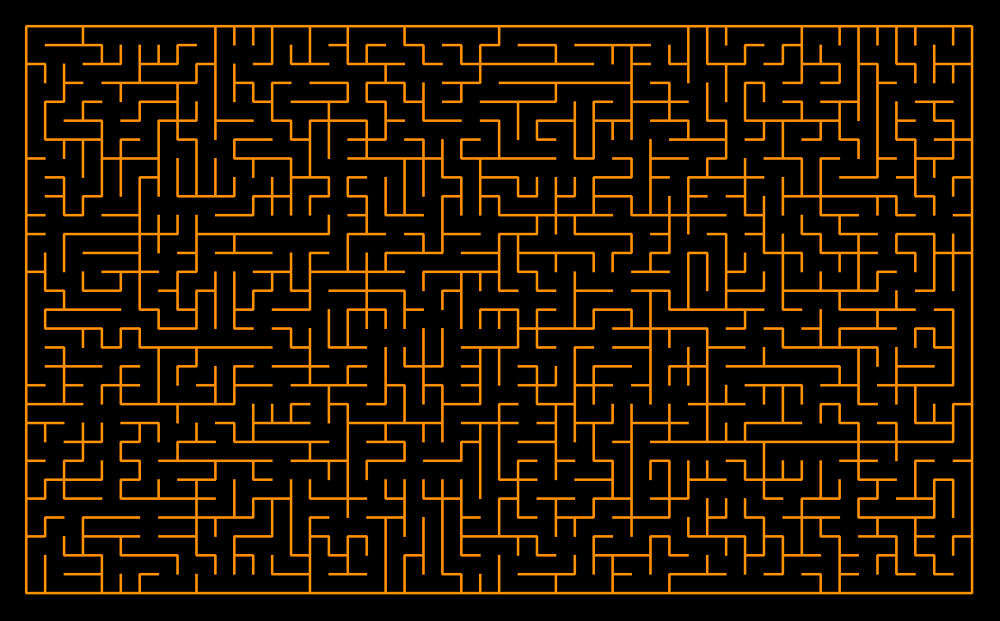

# Генератор лабиринтов

## Базовый функционал
- Генерация с помощью DFS или минимального остовного дерева (поддержка
обоих вариантов). Вариант генерации выбирается с помощью аргумента
командной строки.

- Отображение лабиринтов в консоли с помощью специальных символов.

- Сохранение/загрузка лабиринтов в/из файлов.

- Решение лабиринтов и отображение пути.

## Бонусный функционал
- Более сложные алгоритмы: Алгоритм A Star

- Графический интерфейс

## Запуск проекта
Для запуска проекта требуется модуль PyGame

Для запуска проекта надо написать
```
python3 main.py
```

## Графика

### Обозначения
- Зеленая клетка - начало пути

- Красная клетка - конец пути

- Синим обозначается кратчайший путь

- Розовым - клетки, которые просматривал алгоритм

### Функционал

- Чтобы зафиксировать точку нужно нажать на клетку

- Чтобы сбросить выбор точки надо нажать на клетку вне лабиринта

- Алгоритм ищет кратчайший путь от зеленой клетки до красной

- Можно заметить, что алгоритм А* просматривает меньше клеток, чем BFS

## Вот пример работы графики



## Консольная графика

Пример отображения лабиринта в консоли в файле my_maze.txt